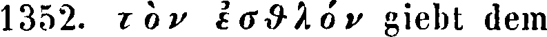
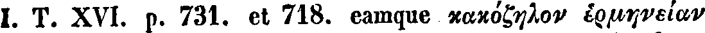
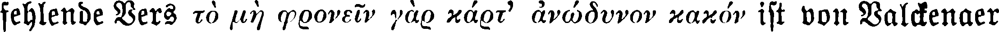

# OCR kraken models

List of models to be published:

| Name  | Description | Model file | Example |
| ------------- | ------------- | ------------- | ------------- |
| `greek-english_porson`  | Model for English commentaries with Polytonic Greek text typeset in Porson (or Porson-like) fonts.  | [`TBD`](./greek-english_porson/)| 
| `greek-english_porson_sophoclesplaysa05campgoog`  | Model based on `greek-english_porson` and enhanced with training materials coming from Jebb's commentary.  | [`TBD`](./greek-english_porson_sophoclesplaysa05campgoog/) | 
| `greek-german_serifs`  | Model for German commentaries typeset with serifs font.  | [`TBD`](./greek-german_serifs/)
| `greek-german_serifs_sophokle1v3soph`  | Model for German commentaries typeset with serifs font. It is based on `greek-german_serifs` and enhanced with materials coming from Schneidewin's commentary.  | [`TBD`](./greek-german_serifs_sophokle1v3soph/) |
| `greek-german_serifs_bsb10234118`  | Model for German commentaries typeset with serifs font. It is based on `greek-german_serifs` and enhanced with materials coming from Lobeck's Latin commentary.   | [`TBD`](./greek-german_serifs/) | 
| `greek-german_serifs-fraktur`  | Model for German commentaries typeset with serifs, black letter (fraktur) font.  | [`TBD`](./greek-german_serifs-fraktur/) | 
